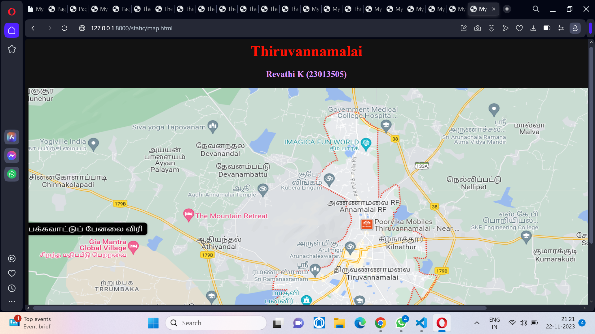
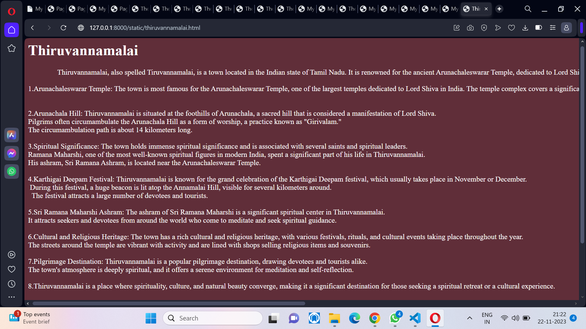

# Ex04 Places Around Me
## Date: 22/11/23

## AIM
To develop a website to display details about the places around my house.

## DESIGN STEPS

### STEP 1
Create a Django admin interface.

### STEP 2
Download your city map from Google.

### STEP 3
Using ```<map>``` tag name the map.

### STEP 4
Create clickable regions in the image using ```<area>``` tag.

### STEP 5
Write HTML programs for all the regions identified.

### STEP 6
Execute the programs and publish them.

## CODE
```
map.html
<html>
    <head>
        <title>My City</title>
    </head>
    <body>
        <center>
        <h1 align="center">
        <font color="red"><b>Thiruvannamalai</b></font>
        </h1>
    </center>
<center>
    <h3 align="center">
    <font color="blue"><b>Revathi K (23013505)</b></font>
</h3>
</center>

    
    <map name="MyCity">
        <area shape="rect" coords="650,380,820,430" href="thiruvannamalai.html" title="My Home Town">
        <area shape="rect" coords="300,200,520,450" href="mountain.html" title="My Home Town">
        <area shape="rect" coords="700,400,900,550" href="imagica fun park.html" title="My Home Town">
        <area shape="rect" coords="750,260,870,390" href="hotel.html" title="My Home Town">
        <area shape="rect" coords="700,350,800,370" href="theatre.html" title="My Home Town">
    </map>
</center>
    </body>
</html>
thiruvannamalai.html

<html>
    <head>
        <title>Thiruvannamalai</title>
        <style>
            body,pre{
                font-family:"Times New Roman";
            }
        </style>
    </head>
        <body bgcolor="Pink">
            <h1>Thiruvannamalai</h1>
            <pre>
                Thiruvannamalai, also spelled Tiruvannamalai, is a town located in the Indian state of Tamil Nadu. It is renowned for the ancient Arunachaleswarar Temple, dedicated to Lord Shiva. Here are some key points about Thiruvannamalai:

1.Arunachaleswarar Temple: The town is most famous for the Arunachaleswarar Temple, one of the largest temples dedicated to Lord Shiva in India. The temple complex covers a significant area and is known for its massive gopurams (entrance towers) and various shrines. The main deity is Lord Shiva, who is worshipped in the form of the "Arunachaleswarar" lingam.


2.Arunachala Hill: Thiruvannamalai is situated at the foothills of Arunachala, a sacred hill that is considered a manifestation of Lord Shiva. 
Pilgrims often circumambulate the Arunachala Hill as a form of worship, a practice known as "Girivalam." 
The circumambulation path is about 14 kilometers long.

3.Spiritual Significance: The town holds immense spiritual significance and is associated with several saints and spiritual leaders. 
Ramana Maharshi, one of the most well-known spiritual figures in modern India, spent a significant part of his life in Thiruvannamalai. 
His ashram, Sri Ramana Ashram, is located near the Arunachaleswarar Temple.

4.Karthigai Deepam Festival: Thiruvannamalai is known for the grand celebration of the Karthigai Deepam festival, which usually takes place in November or December.
 During this festival, a huge beacon is lit atop the Annamalai Hill, visible for several kilometers around.
  The festival attracts a large number of devotees and tourists.

5.Sri Ramana Maharshi Ashram: The ashram of Sri Ramana Maharshi is a significant spiritual center in Thiruvannamalai. 
It attracts seekers and devotees from around the world who come to meditate and seek spiritual guidance.

6.Cultural and Religious Heritage: The town has a rich cultural and religious heritage, with various festivals, rituals, and cultural events taking place throughout the year. 
The streets around the temple are vibrant with activity and are lined with shops selling religious items and souvenirs.

7.Pilgrimage Destination: Thiruvannamalai is a popular pilgrimage destination, drawing devotees and tourists alike. 
The town's atmosphere is deeply spiritual, and it offers a serene environment for meditation and self-reflection.

8.Thiruvannamalai is a place where spirituality, culture, and natural beauty converge, making it a significant destination for those seeking a spiritual retreat or a cultural experience.


            </pre>
            


        </body>
    
</html>


mountain.html

<html>
<head>
<title>My Home Town</title>
</head>
<body bgcolor="black">
<h1 align="cen<html>
ter">
<font color="red"><b>The Mountain Retreat(Arunachala Hill)</b></font>
</h1>
<hr size="3" color="red">
<p align="justify">
<font face="Georgia" size="3">
    Arunachala Hill is a sacred mountain in the town of Thiruvannamalai in the Indian state of Tamil Nadu. 
    It is known as the Annamalai Hill and is associated with the Annamalaiyar Temple,
     which is dedicated to the Hindu deity Shiva. The temple and the hill are considered 
     highly sacred in Hinduism, and the hill is often referred to as Arunachala.

    Here are some key points about Arunachala Hill:
    
    Religious Significance: Arunachala is considered a manifestation of the Hindu god Shiva and 
    is revered as one of the Panchabhoota Sthalas, representing the element of fire. 
    The Annamalaiyar Temple, located at the base of the hill, is one of the largest and 
    most important Shiva temples in Southern India.
    
    Arunachala Purana: The Arunachala Purana, a religious text, extols the greatness of Arunachala 
    and narrates various legends associated with the hill. It is believed that 
    circumambulating the hill (a practice known as Girivalam) is spiritually significant.
    
    Girivalam (Circumambulation): Devotees often undertake a ritualistic walk 
    around the base of Arunachala Hill, covering a distance of about 14 kilometers. 
    This practice, known as Girivalam, is considered auspicious, and many pilgrims undertake 
    it during full moon days.
    
    Ramana Maharshi: The 20th-century sage Ramana Maharshi spent a significant part of his life 
    in the town of Thiruvannamalai, residing near Arunachala. He considered Arunachala to be a
     spiritual force and recommended the practice of self-inquiry, asking the question "Who am I?" 
     to seekers.
    
    Arunachala in Literature: Arunachala has been praised in various literary works, 
    including poems by the famous Tamil saint-poet Manickavacakar. 
    The hill has inspired numerous poets and seekers throughout history.
    
    Arunachala Deepam: The Karthigai Deepam festival, celebrated during the Tamil month 
    of Karthigai (November-December), is one of the most significant festivals 
    associated with Arunachala. A massive lamp is lit on the hill during this festival,
     and it is visible for miles around.
    
    Arunachala is not just a geographical feature but is deeply embedded in the spiritual and 
    cultural fabric of the region, attracting pilgrims and seekers from various parts of the country.
</font>
</p>
</body>
</html>


imagica fun park.html

<html>
<head>
<title>My Home Town</title>
</head>
<body bgcolor="saffron">
<h1 align="center">
<font color="black"><b>Imagica Fun world</b></font>
</h1>

<hr size="3" color="red">
<p align="justify">
<font face="Georgia" size="5">
    As of my last knowledge update in January 2022, there isn't a widely recognized "Fun World"
     that is specifically associated with Thiruvannamalai. However, the term "Fun World"
      is relatively generic and could be used by different amusement parks, entertainment centers, 
      or businesses.

If you're looking for a specific Fun World in a particular location, it would be helpful to
 provide more details such as the city or region you're referring to. 
 There are several amusement parks and entertainment centers with similar names in
  different parts of the world.

To get the most accurate and up-to-date information, consider checking local directories, 
tourism websites, or contacting local authorities or tourism offices in the specific location 
you're interested in. Additionally, online search engines and travel forums may have information
 on any Fun World attractions in your desired area.


</font>
</p>
</body>
</html>


hotel.html

<html>
<head>
<title>My Home Town</title>
</head>
<body bgcolor="litte blue">
<h1 align="center">
<font color="red"><b>Thalappakatti</b></font>
</h1>
<hr size="3" color="red">
<p align="justify">
<font face="Arial" size="5">
    As of my last knowledge update in January 2022, Thalappakatti is a popular
     South Indian restaurant chain known for its biryani. 
     The Dindigul Thalappakatti Biriyani restaurant, often simply called Thalappakatti, 
     originated in Dindigul, Tamil Nadu, and has expanded to various locations in India 
     and even internationally.

Key points about Thalappakatti:

Specialty: Thalappakatti is particularly famous for its Dindigul Thalappakatti Biriyani, 
a flavorful and aromatic biryani that has gained popularity among biryani enthusiasts.

Expansion: The brand has expanded its presence, and you can find Thalappakatti restaurants
 in various cities across India.

Menu: While biryani is a highlight, Thalappakatti restaurants typically offer a variety 
of South Indian dishes, including other rice preparations, vegetarian and non-vegetarian options,
 and traditional desserts.

Legacy: The brand has a long history, dating back to the 1950s, and is known for maintaining
 the authenticity and taste of its biryani recipe.

For the most current information, including the existence of any hotels associated with
 Thalappakatti or specific details about a location in Thiruvannamalai, 
 I recommend checking the official Thalappakatti website, contacting the restaurant directly, 
 or using local directories and review platforms. Additionally, local residents or tourism 
 information centers in Thiruvannamalai may provide relevant information.


</font>
</p>
</body>
</html>


theatre.html

<html>
<head>
<title>My Home Town</title>
</head>
<body bgcolor="orange">
<h1 align="center">
<font color="red"><b>Anbu Theatre</b></font>
</h1>

<hr size="3" color="red">
<p align="justify">
<font face="Georgia" size="5">
    As of my last knowledge update in January 2022, Anbu Cinemas is a well-known cinema chain in India.
     Anbu cinemas, which stands for Priya Village Roadshow, is one of the largest and 
     most popular cinema exhibition companies in the country. 
     It operates a network of multiplex theaters in various cities.

Anbu Cinemas typically offers a range of movie-viewing experiences, 
including standard screens, IMAX, 4DX, Gold Class, and more. They often provide online booking services, 
allowing customers to choose their seats and purchase tickets in advance.

For the most up-to-date information on Anbu Cinemas locations, showtimes, and offerings, 
I recommend checking the official Anbu Cinemas website or using their official mobile app.
 Additionally, you can check local directories or online movie ticketing platforms for 
 information on Anbu Cinemas in specific locations.

Please note that details about cinema chains and their locations can change over time
, so it's a good idea to verify the information from official sources or contact the cinema 
directly for the latest updates.


</font>
</p>
</body>
</html>

```

## OUTPUT




## RESULT
The program for implementing image maps using HTML is executed successfully.
